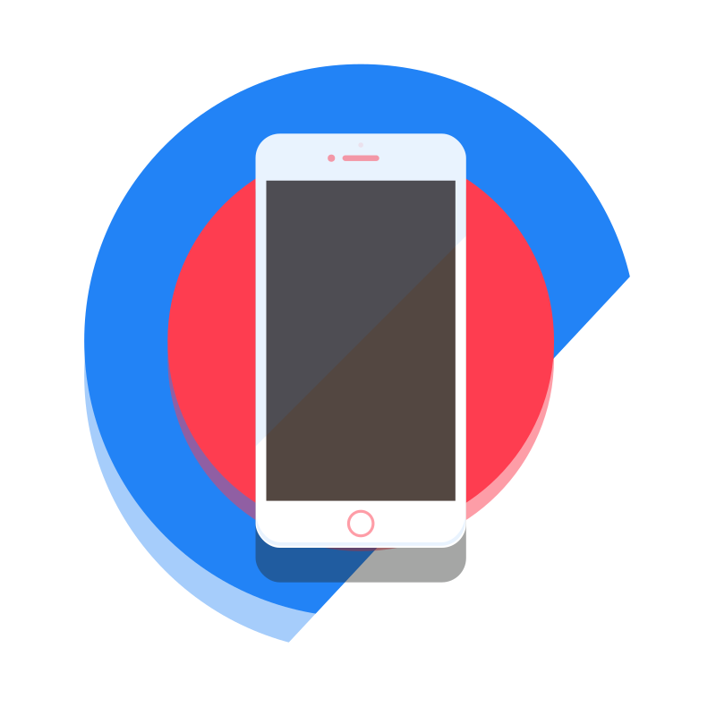
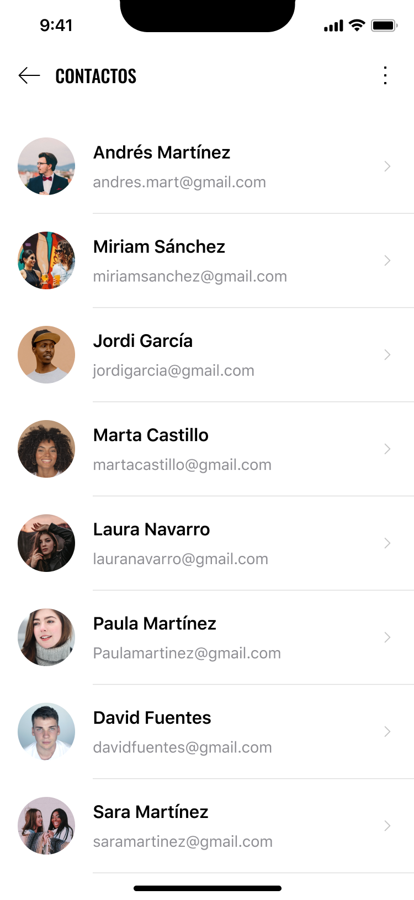
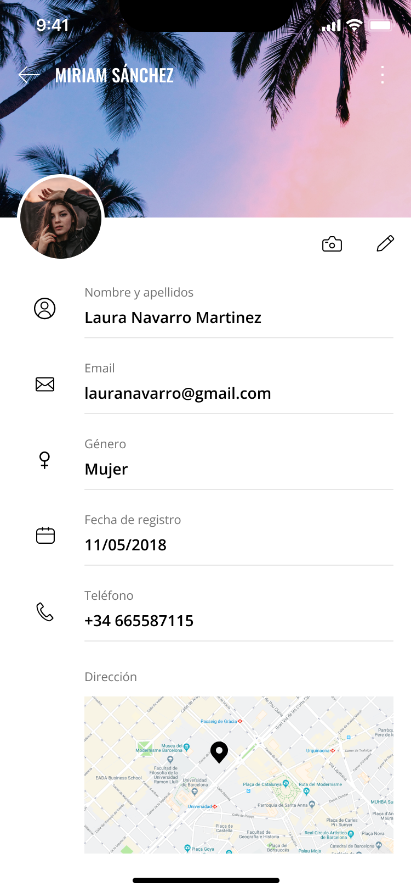
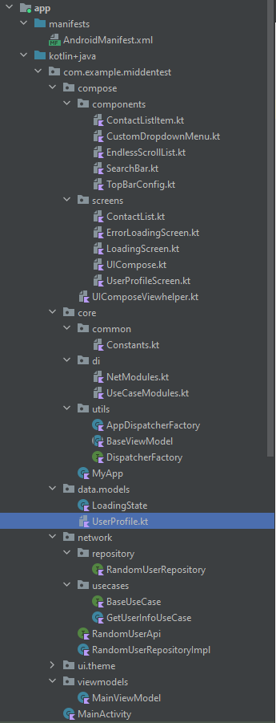

# MiddenTest
This is a technical test for Mind Den.
  

## Explanation
The application consist of two screens, one shows a list of users and the other the detail of users.
The information comes from https://randomuser.me/api/, a Rest API service which generates users. For this test, I used the seed "Midden".
There is a function which ensures there isn't duplicate data showing in the app.
There is also a search feature which allows the user to search by name or email for a concrete user.
You can scroll indefinitely on the app until the information is completely loaded.

## App structure
The app is made using Kotlin and Jetpack Compose. It's structured the following way:

 - There is a folder called "compose" in which there are all the UI
   components. They are divided in "screens" and "components" which
   compose those screens. All the App is done in UICompose and depending
   on which screen is visible the navigator goes to one screen or the
   other. There is also a Viewhelper taking care of functions used in
   more than one screen or big functions which doesn't need to be in one
   screen or component.
   
- In "core" folder you can find components common for all the app like
   modules for Koin injection dependencies or constants.
   
- In "data/models", you can find the models used for this app,
   LoadingState for processing the loading states from the API and
   UserProfile which has all the data classes needed for the information
   coming from the API.
   
- In "network", you can find all the components related with the API
   connection using Retrofit. The API Service, the repository and the
   UseCase. You can find their respective tests in the test section of
   the app.
- This part of the app communicates with the UI using a
   viewmodel which is located in "viewmodels".
    

